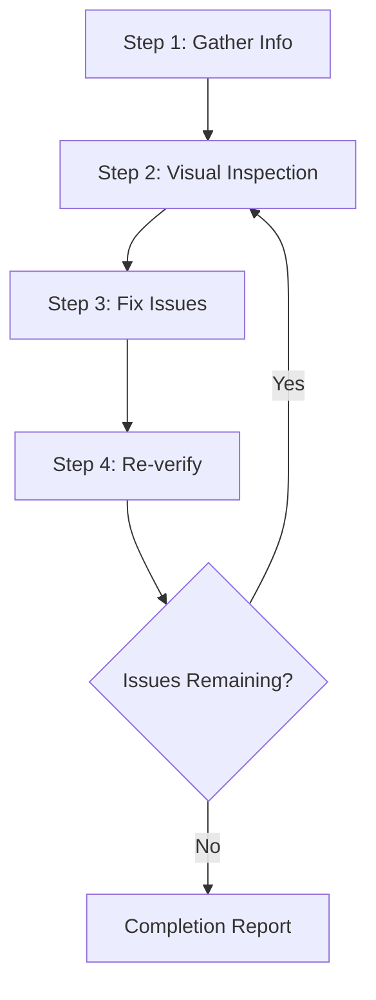

# Web Design Reviewer

This skill enables visual inspection and validation of website design quality, identifying and fixing issues at the source code level.

Works with:
- Running Storybook (`http://localhost:6006`)
- Local development server (`http://localhost:3000`)
- Any staging or production URL (read-only for production)

---

## Prerequisites

1. **Target must be running** — start Storybook with `npm run storybook` or the app with `npm run dev`
2. **Browser automation available** — screenshot capture, page navigation, DOM retrieval
3. **Source code access** — for making fixes, the project must be in the workspace

---

## Workflow



---

## Step 1: Information Gathering

### 1.1 URL Confirmation

If not provided, ask:
> Please provide the URL to review (e.g., `http://localhost:6006` for Storybook or `http://localhost:3000`)

### 1.2 Automatic Project Detection

Auto-detect from workspace files:
- `package.json` → Framework and dependencies
- `tsconfig.json` → TypeScript usage
- `next.config.ts` → Next.js (this project uses Next.js)
- `src/app/themes/` → MUI theme tokens (Foundation uses MUI `sx` with theme tokens)
- `src/components/` → Component source files
- `src/stories/` → Storybook stories

### 1.3 Foundation-specific Context

This is a **MUI + Next.js design system**. When reviewing:
- Spacing and sizing should come from `theme.spacing()` — flag any hardcoded px values in `sx` props
- Colours should use semantic tokens (e.g., `primary.main`, `text.secondary`) — flag any hardcoded hex/rgb
- Font sizes must use `rem` — flag any `px` font sizes
- Typography must use the Foundation scale: `display-1`–`display-5`, `h1`–`h6`, `lead`, `body`, `small`, `caption` — flag `body1`, `body2`, `subtitle1`, `subtitle2`
- Layout/flex props belong in `sx`, not as direct component props

---

## Step 2: Visual Inspection

### 2.1 Page Traversal

1. Navigate to the specified URL
2. Capture screenshots
3. Retrieve DOM structure if possible
4. For Storybook: traverse through story navigation to cover multiple components

### 2.2 Inspection Items

#### Layout Issues

| Issue | Description | Severity |
|-------|-------------|----------|
| Element Overflow | Content overflows from parent or viewport | High |
| Element Overlap | Unintended overlapping | High |
| Alignment Issues | Grid or flex alignment problems | Medium |
| Inconsistent Spacing | Padding/margin inconsistencies | Medium |
| Text Clipping | Long text not handled properly | Medium |

#### Responsive Issues

| Issue | Description | Severity |
|-------|-------------|----------|
| Non-mobile Friendly | Layout breaks on small screens | High |
| Breakpoint Issues | Unnatural transitions between sizes | Medium |
| Touch Targets | Buttons too small on mobile (< 44px) | Medium |

#### Accessibility Issues

| Issue | Description | Severity |
|-------|-------------|----------|
| Insufficient Contrast | Contrast ratio below 4.5:1 for text | High |
| No Focus State | Keyboard focus not visible | High |
| Missing alt Text | No alt text for images | Medium |

#### Visual Consistency (Foundation-specific)

| Issue | Description | Severity |
|-------|-------------|----------|
| Hardcoded colours | `#hex` or `rgb()` in `sx` instead of token | High |
| Hardcoded spacing | `px` spacing in `sx` instead of `theme.spacing()` | Medium |
| Wrong typography variant | `body1`, `body2` etc. instead of Foundation scale | Medium |
| Font size in px | Font sizes not in `rem` | Medium |
| `style={{}}` prop | Inline styles instead of `sx` | Medium |

### 2.3 Viewport Testing

| Name | Width | Device |
|------|-------|--------|
| Mobile | 375px | iPhone SE |
| Tablet | 768px | iPad |
| Desktop | 1280px | Standard PC |
| Wide | 1920px | Large display |

---

## Step 3: Issue Fixing

### 3.1 Priority Matrix

- **P1 — Fix Immediately**: Layout issues affecting functionality, missing focus states
- **P2 — Fix Next**: Visual issues degrading UX, token violations, wrong typography variants
- **P3 — Fix If Possible**: Minor visual inconsistencies, spacing drift

### 3.2 Finding Source Files

1. Search by class name or `sx` prop content with `grep_search`
2. Identify components from element structure with `semantic_search`
3. File patterns:
   - Components: `src/components/**/*`
   - Stories: `src/stories/**/*`
   - Pages: `src/app/**/*`
   - Theme: `src/app/themes/`

### 3.3 Fix Principles

1. **Minimal changes** — only what's needed to resolve the issue
2. **Respect existing patterns** — follow `sx` with theme tokens, rem sizing
3. **Avoid breaking changes** — be careful not to affect other components
4. **Never hardcode** — replace `#hex` with `primary.main`, `16px` with `theme.spacing(2)` or `1rem`

---

## Step 4: Re-verification

1. Reload browser (or wait for HMR)
2. Capture screenshots of fixed areas
3. Compare before and after
4. Verify fixes haven't introduced regressions
5. **Iteration limit**: If more than 3 attempts fail for a specific issue, consult the user

---

## Output Format

```markdown
# Web Design Review Results

## Summary
| Item | Value |
|------|-------|
| Target URL | {URL} |
| Framework | Next.js + MUI (Foundation) |
| Tested Viewports | Desktop 1280px, Mobile 375px |
| Issues Detected | {N} |
| Issues Fixed | {M} |

## Detected Issues

### [P1] {Issue Title}
- **Page/Story**: {path}
- **Element**: {selector or description}
- **Issue**: {description}
- **Fixed File**: `{file path}`
- **Fix**: {what changed}

## Unfixed Issues (if any)
### {Issue Title}
- **Reason**: {why not fixed}
- **Recommended Action**: {recommendation}

## Recommendations
- {future improvements}
```

---

## Best Practices

- ✅ Save screenshots before making fixes
- ✅ Fix one issue at a time and verify each
- ✅ Follow Foundation token conventions (no hardcoded values)
- ✅ Confirm with user before major changes
- ❌ No large-scale refactoring without confirmation
- ❌ Don't ignore the design system token rules
- ❌ Don't fix multiple issues simultaneously
