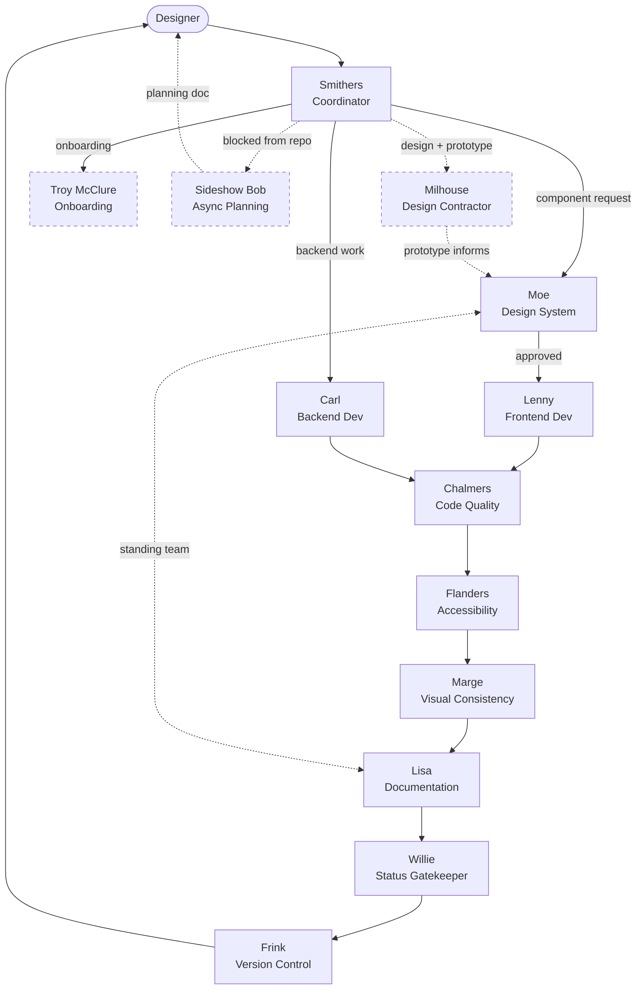

# Team relationship map

> Moved out of `AGENTS.md` to keep the always-on context lean. This is on-demand reference. The routing table, pipeline sequence, and agent roles remain in `AGENTS.md`.

Solid arrows = mandatory pipeline steps. Dashed arrows = optional or off-pipeline relationships.

